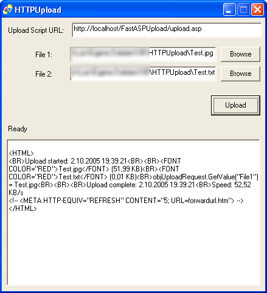

## HTTP File Upload using Winsock API

### Description

This is a small example that shows how to upload files to a web server through HTTP Post using Winsock API, this is as low level and as dependency-free as you can get. It also includes an HTTP header class that makes it easy to add fields or files to be sent. You can use the included ASP upload script to test the program.
 
### More Info
 

             |
---                |---
**Submitted On**   |2005-08-10 23:46:46
**By**             |[Luis Cantero](https://github.com/Planet-Source-Code/PSCIndex/blob/master/ByAuthor/luis-cantero.md)
**Level**          |Intermediate
**User Rating**    |5.0 (20 globes from 4 users)
**Compatibility**  |VB 6\.0
**Category**       |[Internet/ HTML](https://github.com/Planet-Source-Code/PSCIndex/blob/master/ByCategory/internet-html__1-34.md)
**World**          |[Visual Basic](https://github.com/Planet-Source-Code/PSCIndex/blob/master/ByWorld/visual-basic.md)
**Archive File**   |[HTTP\_File\_1936841022005\.zip](https://github.com/Planet-Source-Code/luis-cantero-http-file-upload-using-winsock-api__1-62746/archive/master.zip)

